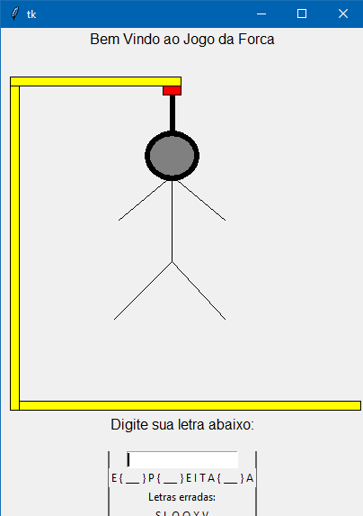

# Jogo da Forca
> Projeto simples do famoso jogo da forca

Este projeto tem como base o famoso jogo da forca que todo mundo já jogou na escola. Aqui neste projeto se trabalhou com leitura de arquivos, condicionais, criação de interface e tratamento de dados do tipo try/except/else/finally.

---

## Módulos utilizados
A interface foi criada utilizando-se o Tkinter, a música foi por conta do playsound e a escolha randomizada pelo módulo RANDOM.
Instalando Tkinter:
`pip install tkinter`
Instalando Playsound:
`pip install playsound`

## Uso
Este projeto é um bom inicio para aprender a criar interfaces simples pelo python e entender um pouco de mecânicas de construção dos mesmos. Além de ser um excelente jeito de passar o tempo jogando.

## Meta
Gregory Wells de Carvalho Barteles - gregorywells93@gmail.com.